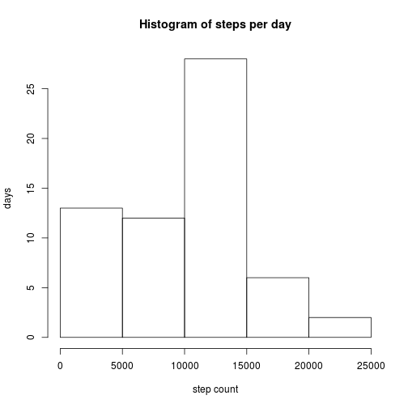
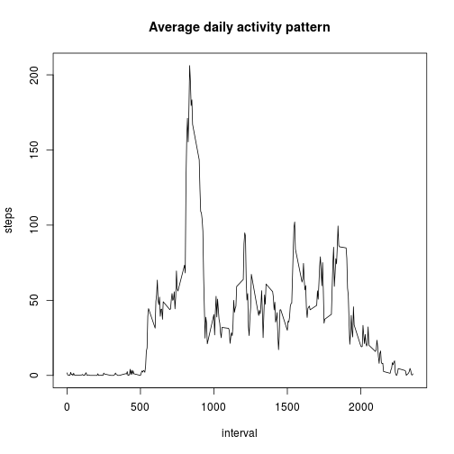
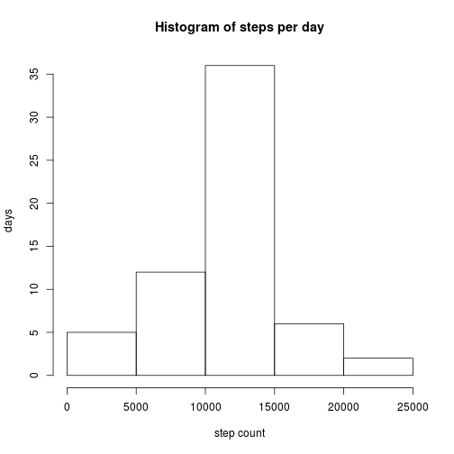
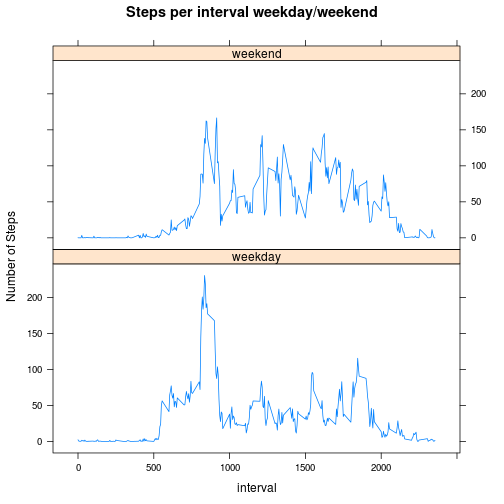

Reproducible Research Peer Assessment 1
========================================

##Loading and Preprocessing Data

The data for this assignment was downloaded and unzipped from [Activity Monitoring Data](https://d396qusza40orc.cloudfront.net/repdata%2Fdata%2Factivity.zip) on Fri, Mar  6 2015 10:51:39. The resulting file is named activity.csv.

The following R code will load the file into a dataframe and change the data column to a date variable:

```r
activity <- read.csv("activity.csv")
activity$date <- as.Date(activity$date)
```


##Total number of steps per day

The total number of steps per day can be calculated by using tapply on the activity dataframe:

```r
stepsperday <- data.frame(tapply(activity$steps, as.factor(activity$date),
                                 sum, na.rm = TRUE))
names(stepsperday) <- "steps"
```

The following code creates a histogram of total number of steps taken each day:

```r
hist(stepsperday$steps, main = "Histogram of steps per day",
     xlab = "step count", ylab = "days")
```

 

The mean total number of steps per day is:

```r
mean(stepsperday$steps)
```

```
## [1] 9354.23
```

The median total number of steps per day is:

```r
median(stepsperday$steps)
```

```
## [1] 10395
```

##Average daily activity pattern

The following code uses tapply to calculate then mean number of steps per 5 minute interval, then creates a time series plot of the 5 minute interval and the average number of steps taken, averaged across all days.

```r
pattern <- data.frame(tapply(activity$steps, as.factor(activity$interval),
                             mean, na.rm = TRUE))
names(pattern) <- "steps"
pattern$interval <- row.names(pattern)
with(pattern, plot(interval, steps, main = "Average daily activity pattern",
                   type = "l"))
```

 

The interval with maximum average steps is the following:

```r
pattern[pattern$steps == max(pattern$steps),]
```

```
##        steps interval
## 835 206.1698      835
```

Average peak activity for this subject is around 8:30 am.

##Imputing missing values

The number of rows with missing values in the dataset is:

```r
sum(is.na(activity$steps))
```

```
## [1] 2304
```

###Strategy for replacing missing values

Missing values will be replaced by the mean number of steps for that 5 minute interval.

The following code will create a new dataset with missing data filled in. The code will:  
1. Copy the original dataframe to a new dataframe.  
2. Create a list of intervals with NA values for steps.  
3. Take each interval with NA and look at the corresponding mean value in the pattern dataframe. Create a list of the mean number of steps for each of the intervals in the first list.  
4. Replace NAs in the new dataframe with the mean value from the list just created.  


```r
activity2 <- activity
na_intervals <- activity2[is.na(activity2$steps), "interval"]
na_replace <- pattern[as.character(na_intervals), "steps"]
activity2$steps[is.na(activity2$steps)] <- na_replace
```

The histogram for the new data set is:

```r
stepsperday <- data.frame(tapply(activity2$steps, as.factor(activity2$date),
                                 sum, na.rm = TRUE))
names(stepsperday) <- "steps"
hist(stepsperday$steps, main = "Histogram of steps per day",
     xlab = "step count", ylab = "days")
```

 

The mean total number of steps per day is:

```r
mean(stepsperday$steps)
```

```
## [1] 10766.19
```

The median total number of steps per day is:

```r
median(stepsperday$steps)
```

```
## [1] 10766.19
```

It can be seen from the new histogram and mean and median values that replacing the NAs does change the results of the analysis. The result of imputing missing values adds to the total step counts per day, meaning more days with more steps, and a higher mean and median.

##Difference in activity patterns between weekends and weekdays

To compare activity patterns between weekends and weekdays, we can create a new factor variable in the activity2 dataframe to indicate weekday or weekend:

```r
activity2$weekday <- weekdays(activity2$date)
activity2$weekday[activity2$weekday == "Monday"] <- "weekday"
activity2$weekday[activity2$weekday == "Tuesday"] <- "weekday"
activity2$weekday[activity2$weekday == "Wednesday"] <- "weekday"
activity2$weekday[activity2$weekday == "Thursday"] <- "weekday"
activity2$weekday[activity2$weekday == "Friday"] <- "weekday"
activity2$weekday[activity2$weekday == "Saturday"] <- "weekend"
activity2$weekday[activity2$weekday == "Sunday"] <- "weekend"
```

To visualize the difference between mean steps per interval on weekends vs. mean steps per interval on weekdays, we can create summary data frame using the plyr package and ddply:

```r
library(plyr)
df <- ddply(activity2, .(weekday, interval), summarise, steps = mean(steps))
```

Then to plot the summary using the lattice package:

```r
library(lattice)
xyplot(steps ~ interval | weekday, data = df, type = "l", ylab = "Number of Steps",
       main = "Steps per interval weekday/weekend",
       layout = c(1,2)
       )
```

 

It can be seen from the panel plot that the number of steps per interval is generally higher through the day on weekends. While steps peak in the morning during the week, the subject appears to be more active throughout the day on weekends.  


